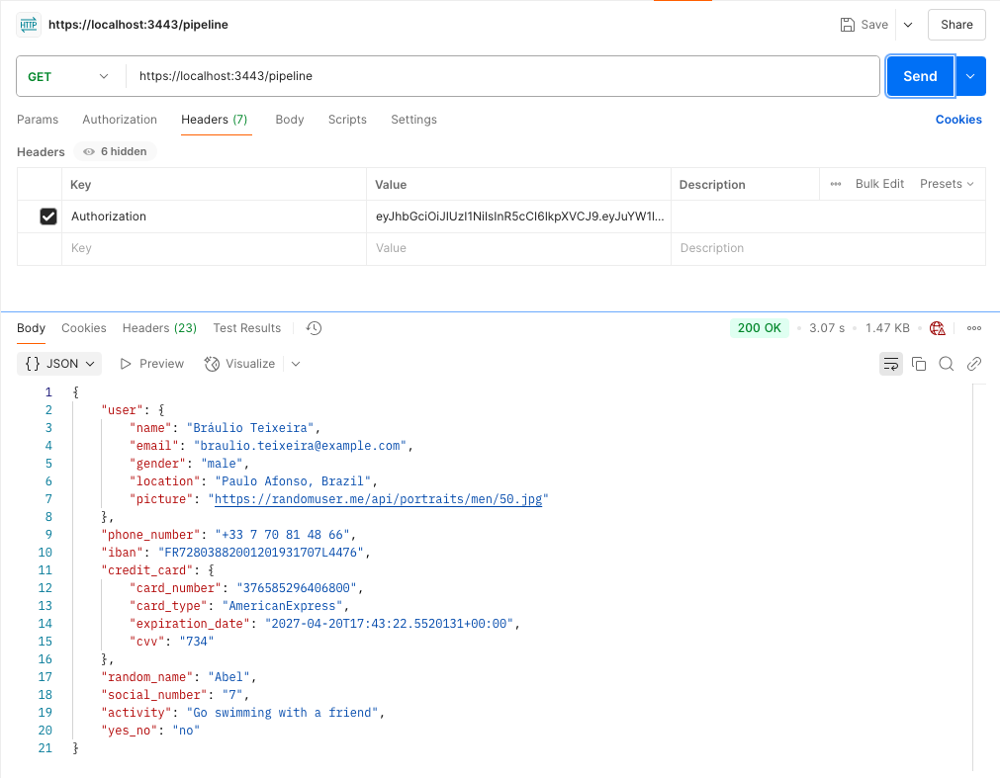

# API Users

## Overview
The API allows users to retrieve all of the users of the application in micro service through a REST architecture. This API will be mainly used for registed Accounts.

It will also create own users to recover data to the platform but is in no way related to the users collected via the crawling of profiles on Social Networks.

### [POST] Create user
Allows the creation of a single user.

|                            |                  |
|----------------------------|------------------|
| Requires authentication ?  | No               |
| Who can use it ?           | Owner and users  |
| Response formats           | application/json |

* HTTP request : POST → user/create

#### Parameters :
```javascript
{
  'firstname': String, // Optional
  'lastname': Number, // Optional
  'age': Number, // Optional
  'city': String // Optional
}
```

#### Response :
```javascript
  {
    id: Object_ID,
    firstname: String,
    lastname: String,
    age: Number,
    city: String
  }
```

### [POST] Show user
Show an user by id.

|                            |                  |
|----------------------------|------------------|
| Requires authentication ?  | No               |
| Who can use it ?           | Owner and users  |
| Response formats           | application/json |

* HTTP request : GET → user/show/:id

#### Parameters :
```javascript
{
  id: String // Required
}
```

#### Response :
```javascript
  {
    id: Object_ID,
    firstname: String,
    lastname: String,
    age: Number,
    city: String
  }
```

### Requirements
* node 18
* npm or yarn or pnpm
* git
* mongodb (please configure config.js for link mongodb)

### Install
```npm i```

### Production mode
```npm run prod```

### Dev mode
```npm run dev```

---

## Exemple d'appel à l'API `/pipeline` (HTTP)

La route `/pipeline` est sécurisée par un token d'authentification (à obtenir via la route http://localhost:3000/auth).

Exemple de réponse :


---

## Exemple d'appel à l'API `/pipeline` (HTTPS)

Le serveur peut aussi être lancé en HTTPS avec :

```bash
node src/server-https.mjs
```

Exemple de réponse en HTTPS :



---